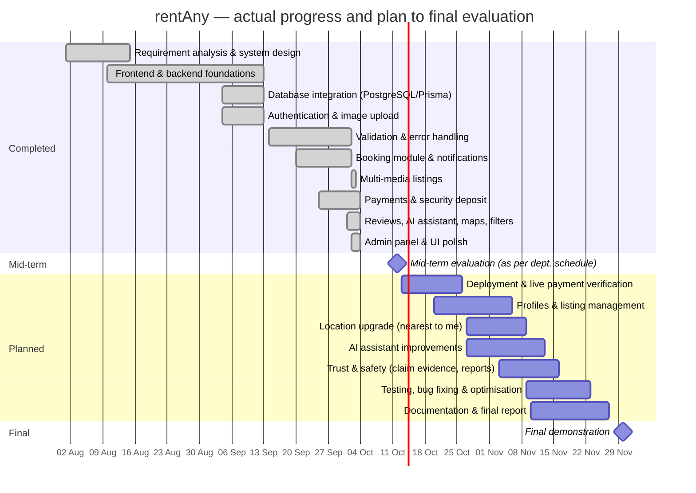

# rentAny — Project Workflow (v2, updated October 2026)

Minor project · 7th semester B.E. CSE · UIET, Panjab University · July–December 2026

**Team:** Mukul Bhardwaj (UE233066) · Prashant Yadav (UE233075) · Pratham Mahajan (UE233076)

This document updates the original *rentAny workflow* (PDF) with what has actually been built so far and the plan up to the final evaluation.

---

## 1. Project summary

rentAny is a web-based peer-to-peer rental platform where people rent and lend everyday items **by the hour**. Owners list items with photos/videos, price, deposit and location; renters find items, request bookings, pay online, and return them. The platform earns a fixed fee per booking and holds a refundable security deposit to protect owners.

### Aims from the original workflow — status

| Aim (original PDF) | Status |
|---|---|
| Online platform for renting items by the hour | ✅ Done |
| Owners list items with images, descriptions, charges and availability | ✅ Done (photos + videos, deposit, live availability) |
| Simple, secure booking and payment between renters and owners | ✅ Done (Razorpay test mode) |
| Transparency through profiles, ratings and reviews | ✅ Ratings & reviews done · full profile pages planned |
| Enable owners to earn from under-used items | ✅ Booking + payment flow done · owner payouts planned |
| Map-based route guidance between renter and provider | ✅ Basic map + directions · precise "nearest to me" planned |
| AI chatbot that recommends items for an occasion | ✅ Done (grounded in the live catalogue) |

---

## 2. Progress against the original Gantt chart

| Phase (original plan) | Planned | Status |
|---|---|---|
| Requirement analysis & system design | Aug | ✅ Complete |
| Frontend development | Aug – mid Sep | ✅ Complete |
| Backend & API development | Aug – mid Sep | ✅ Complete |
| Database integration | mid Sep | ✅ Complete |
| Authentication & image upload | mid – end Sep | ✅ Complete (extended to multi-photo/video) |
| Payment gateway & security deposit | Oct | ✅ Implemented (test mode) — live webhook verification pending |
| Booking module & testing | Oct – early Nov | ✅ Implemented, 116 automated tests |
| Admin panel & dispute handling | Nov | ✅ Implemented |
| Bug fixing & optimisation | Nov | ⏳ Ongoing |
| Documentation & final report | Nov | ⏳ Ongoing |
| Final demonstration | end Nov | ⏳ Planned |

Additional work beyond the original plan: in-app notifications, reviews & ratings, AI rental assistant, Home filters/sorting, item maps, and a UI/UX polish pass.

---

## 3. What has been built (by module)

### 3.1 Accounts & security
- Registration and login with JWT; bcrypt password hashing; required, validated phone numbers.
- Consistent validation and error responses across the API; strict CORS; startup configuration checks.
- Roles (`USER`, `ADMIN`); secrets kept only on the server.

### 3.2 Listings & media
- Listings with category, hourly price, location and refundable deposit (₹0–₹50,000).
- Up to 10 photos/videos per listing via signed direct uploads to Cloudinary; uploads verified on the server before being attached; failed uploads cleaned up.
- Home page search, sorting (newest, price, rating) and filters (category, price range, area); item page gallery, map and directions.

### 3.3 Booking module
- Requests for 1–72 hours up to 30 days ahead; owner accepts/rejects; overlapping requests auto-rejected.
- Overlap prevention enforced by a PostgreSQL exclusion constraint plus row locking (safe under concurrent requests).
- Lifecycle: `PENDING → ACCEPTED → CONFIRMED (paid) → ACTIVE → COMPLETED`, with cancellation and lazy + scheduled expiry.

### 3.4 Payments & security deposit
- Razorpay Standard Checkout (test mode): server-created orders, signature verification **and** server-side payment lookup, signed webhooks, reconciliation.
- ₹49 platform fee; booking amounts snapshotted; 12-hour payment window.
- Versioned cancellation policy; idempotent refunds with retry and audit log.
- Deposit claims within 48 hours of return → renter accepts/disputes → admin resolves → remaining deposit refunded automatically.

### 3.5 Reviews, notifications, AI assistant, admin
- Two-way reviews after completed rentals with exact average ratings.
- Persistent notifications with an unread badge, polling and toasts.
- AI rental assistant (LLM via the backend) that recommends only real, available listings; graceful fallback.
- Admin panel: dispute resolution, platform overview, refund retries.

### 3.6 Quality
- 116 automated backend tests (`npm test`), including concurrency, idempotency and failure cases, using fakes for Razorpay and the AI service.

---

## 4. Updated Gantt chart (to the final evaluation)

*Mid-term and final evaluation dates are indicative; they follow the department's schedule.*

---

## 5. Plan for the final evaluation

| Work package | Goal |
|---|---|
| Deployment & live payment verification | Host frontend and API (Vercel) with a managed PostgreSQL database; verify Razorpay webhooks end to end in test mode |
| Profiles & listing management | Public profile pages, edit/pause listings, rental and earnings history |
| Location upgrade | Store coordinates for listings; "nearest to me" sorting using the browser's location |
| AI assistant improvements | Better prompts, saved conversations, multi-item plans for an occasion, evaluation of answer quality |
| Trust & safety | Photo evidence for deposit claims, reporting listings, email notifications |
| Testing & optimisation | Browser/E2E tests, accessibility, performance, security review |
| Documentation & final report | Report, user guide, architecture diagrams, final demo preparation |
